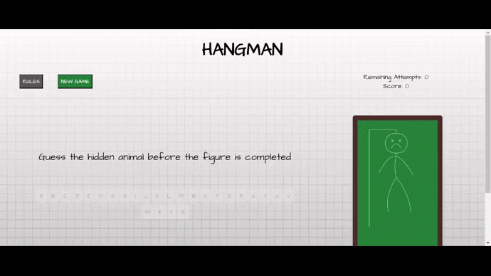

## **THE HANGMAN GAME**

*Welcome to the Hangman Game! Test your word-guessing skills in this classic game.*

## Installation:

1. Clone the GitHub repository to your local machine.
   git clone https://github.com/your-username/hangman-game.git
2. In the root folder, run the command `npm install` to install all dependencies.
3. Run the command `npm start` to start the project.

## How to play:

1. **Start the Game:**
   - Run the game application.
   - Choose a category for the word to guess (for now, just animals).

2. **Game Setup:**
   - The game will randomly select a word.
   - The word will be represented by underscores, indicating the number of letters.

3. **Guessing a Letter:**
   - Attempt to guess the word by entering a letter.
   - If the letter is correct, it will be revealed in the word.
   - If the letter is incorrect, part of the hangman figure will be added.

4. **Winning or Losing:**
   - The game ends when you correctly guess the entire word.
   - If the hangman figure is completed before guessing the word, you lose.

5. **Scoring:**
   - You earn 6 points for guessing a letter correctly.
   - You lose 2 points for an incorrect letter.

## Preview:

In the following GIF, you can visualize the game preview:

